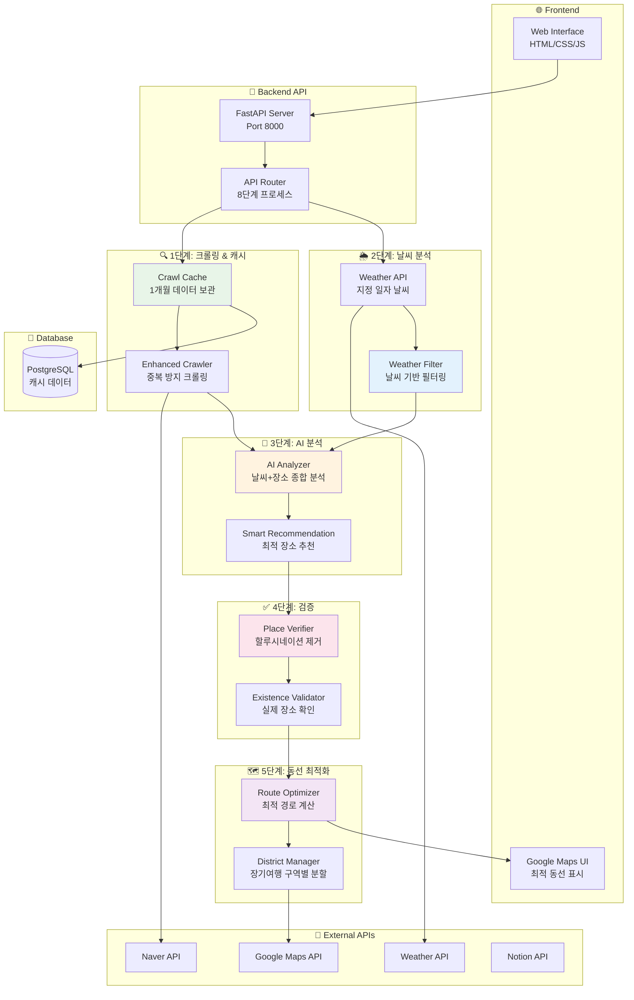
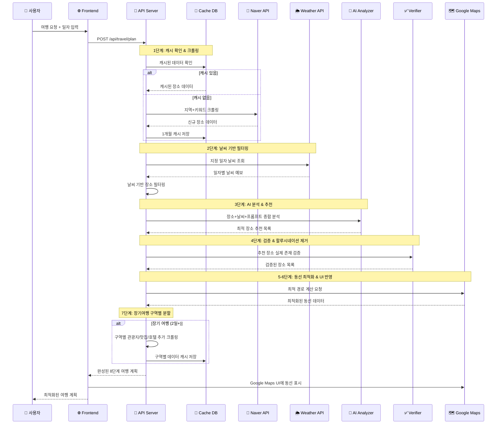

# 🇰🇷 한국 여행 플래너

AI 기반 맞춤형 한국 여행 계획 생성 및 Notion 연동 서비스

## 🎯 프로젝트 개요

OpenAI GPT-4를 활용하여 사용자의 자연어 요청을 30분 단위의 상세한 여행 일정으로 변환하는 시스템입니다. 실제 장소 정보, 대중교통 경로, 비용 정보를 포함한 현실적인 여행 계획을 제공하며, Notion에 자동으로 저장됩니다.

## 🏗️ 시스템 아키텍처 (8단계 최적화 버전)



## ✨ 주요 기능

### 🎯 8단계 최적화 기능

**1단계: 스마트 크롤링**
- 프롬프트 분석 후 네이버 검색으로 실제 장소 먼저 수집
- 1개월 캐시로 중복 크롤링 방지 (리소스 절약)

**2단계: 날씨 기반 필터링**
- 지정된 일자의 날씨 API 연동
- 비오는 날: 실내 장소 우선, 맑은 날: 야외 활동 추천

**3단계: AI 종합 분석**
- 장소 데이터 + 날씨 정보 + 사용자 선호도 종합 분석
- GPT-4가 최적 장소 조합 추천

**4단계: 할루시네이션 제거**
- 추천된 장소들의 실제 존재 여부 재검증
- 네이버 + 구글 교차 검증으로 신뢰도 향상

**5단계: 최적 동선 계산**
- Google Maps API로 최단 경로 및 이동시간 계산
- 구역별 클러스터링으로 효율적 동선 구성

**6단계: Google Maps UI 반영**
- 웹 인터페이스에 실시간 지도 및 경로 표시
- 마커, 경로 라인, 이동시간 정보 제공

**7단계: 장기여행 구역별 세분화**
- 2일 이상 여행시 구역별 관광지/맛집/호텔 추가 크롤링
- 일자별 최적 구역 배치로 효율적 여행 계획

**8단계: 지능형 캐시 시스템**
- PostgreSQL DB에 크롤링 데이터 1개월간 보관
- 동일 검색 시 캐시 데이터 활용으로 응답속도 향상

### 🌟 고급 기능
- **날씨 기반 추천**: 실시간 날씨에 따른 실내/실외 활동 조정
- **구역별 클러스터링**: 효율적 동선 구성
- **품질 검증**: 할루시네이션 방지 및 중복 제거
- **실시간 교통 정보**: 지연, 혼잡도 반영한 경로 선택

## 🚀 빠른 시작

### 1️⃣ 환경 설정
```bash
cd /Users/paul/Documents/venv/travel-recommend-korea
source ../bin/activate
pip install -r requirements.txt
```

### 2️⃣ API 키 설정
`.env` 파일에서 다음 API 키들을 설정하세요:
```bash
# OpenAI (필수)
OPENAI_API_KEY=sk-proj-your-key-here

# Google Maps (필수)
GOOGLE_MAPS_API_KEY=your-google-maps-key

# Notion (선택사항)
NOTION_TOKEN=ntn_your-notion-token
NOTION_DATABASE_ID=your-database-id

# Naver (선택사항)
NAVER_CLIENT_ID=your-naver-client-id
NAVER_CLIENT_SECRET=your-naver-secret

# Weather (선택사항)
OPENWEATHER_API_KEY=your-weather-key
```

### 3️⃣ 서버 실행
```bash
./start_server.sh
# 또는
python -m uvicorn app.main:app --reload
```

### 4️⃣ 웹 접속
- **메인 페이지**: http://localhost:8000
- **API 문서**: http://localhost:8000/docs

## 📁 프로젝트 구조

```
travel-recommend-korea/
├── 🌐 Frontend
│   ├── index.html              # 메인 웹 인터페이스
│   ├── results.html            # 결과 페이지
│   └── script.js               # JavaScript 로직
│
├── 🔧 Backend (app/)
│   ├── main.py                 # FastAPI 애플리케이션
│   ├── api/
│   │   └── endpoints.py        # API 엔드포인트 정의
│   ├── core/
│   │   └── config.py          # 설정 관리
│   └── services/
│       ├── openai_service.py  # OpenAI 연동
│       ├── naver_service.py   # 네이버 API
│       ├── google_maps_service.py # Google Maps
│       ├── notion_service.py  # Notion 연동
│       ├── weather_service.py # 날씨 정보
│       ├── blog_crawler_service.py # 블로그 크롤링
│       ├── place_verification_service.py # 장소 검증
│       ├── realtime_transport_service.py # 실시간 교통
│       └── route_optimizer_service.py # 경로 최적화
│
├── 🚀 Scripts
│   └── start_server.sh        # 서버 실행
│
├── ⚙️ Configuration
│   ├── .env                  # 환경변수 (API 키)
│   └── requirements.txt      # Python 의존성
│
└── 📚 Documentation
    ├── README.md            # 이 파일
    ├── IMPLEMENTATION_STATUS.md # 구현 상태
    └── QUICK_START.md       # 빠른 시작 가이드
```

## 🔄 데이터 플로우 (8단계 최적화)



## 🎨 사용법

### 📝 여행 계획 생성
1. **도시 선택**: 서울, 부산, 제주, 경주, 전주 등
2. **여행 기간**: 당일치기, 1박2일, 2박3일, 3박4일
3. **날짜/시간**: 시작 날짜, 시작/종료 시간 설정
4. **출발지**: 지도에서 출발지 선택
5. **요청사항**: 자연어로 원하는 여행 스타일 입력

### 🗺️ 결과 확인
- **일자별 일정**: 30분 단위 상세 스케줄
- **장소 정보**: 주소, 평점, 가격, 영업시간
- **블로그 후기**: 실제 크롤링된 후기 내용
- **교통 정보**: 실시간 지하철/버스 경로 안내
- **지도 경로**: Google Maps 최적 동선
- **Notion 저장**: 자동 문서화 및 링크 제공

## 🔧 기술 스택

### Frontend
- **HTML5/CSS3**: 시맨틱 마크업
- **Tailwind CSS**: 유틸리티 기반 스타일링
- **Vanilla JavaScript**: 경량화된 클라이언트 로직
- **Google Maps API**: 지도 및 경로 표시

### Backend
- **FastAPI**: 고성능 Python 웹 프레임워크
- **Pydantic**: 데이터 검증 및 직렬화
- **AsyncIO**: 비동기 처리
- **BeautifulSoup**: HTML 파싱 및 크롤링

### AI & External APIs
- **OpenAI GPT-4**: 자연어 처리 및 여행 계획 생성
- **Notion API**: 자동 문서화
- **Google Maps API**: 지도 및 경로 서비스
- **Naver API**: 블로그 검색 및 장소 정보
- **OpenWeatherMap**: 실시간 날씨 정보
- **Seoul Open Data**: 실시간 대중교통 정보

## 📊 API 명세

### 여행 계획 생성
```http
POST /api/travel/plan
Content-Type: application/json

{
  "prompt": "서울에서 당일치기 09:00부터 18:00까지 실내 데이트",
  "preferences": {
    "city": "Seoul",
    "start_date": "2024-01-15",
    "end_date": "2024-01-15",
    "start_time": "09:00",
    "end_time": "18:00",
    "start_location": "서울시 강남구 테헤란로 123"
  }
}
```

### 응답 형식
```json
{
  "plan_id": "uuid-string",
  "title": "AI 추천 여행 계획",
  "summary": "맞춤형 여행 계획 요약",
  "itinerary": [
    {
      "day": 1,
      "time": "10:00",
      "place_name": "롯데월드타워 서울스카이",
      "activity": "전망대 관람",
      "address": "서울시 송파구 올림픽로 300",
      "duration": "90분",
      "description": "서울 전경을 한눈에 볼 수 있는 최고층 전망대",
      "transportation": "지하철 2호선 잠실역 1,2번 출구",
      "rating": 4.6,
      "price": "27,000원",
      "lat": 37.5125,
      "lng": 127.1025,
      "verified": true,
      "blog_reviews": [...],
      "blog_contents": [...]
    }
  ],
  "total_cost": {"amount": 50000, "currency": "KRW"},
  "notion_url": "https://notion.so/...",
  "notion_saved": true,
  "weather_info": {"condition": "맑음", "temperature": "18°C"}
}
```

## 🧪 테스트

### 자동 테스트
```bash
python test_frontend.py
```

### 수동 테스트 체크리스트
- [ ] 폼 입력 및 제출
- [ ] AI 응답 생성 (매번 다른 결과)
- [ ] 일자별 일정 표시
- [ ] 지도 경로 표시
- [ ] 블로그 후기 크롤링
- [ ] 실시간 대중교통 정보
- [ ] Notion 저장 알림
- [ ] 모바일 반응형

## 🚨 문제 해결

### 일반적인 문제

#### API 서버 시작 실패
```bash
lsof -i :8000  # 포트 충돌 확인
kill -9 <PID>  # 프로세스 종료
```

#### OpenAI API 오류
```bash
echo $OPENAI_API_KEY  # API 키 확인
```

#### 지도가 표시되지 않음
- Google Maps API 키 확인
- 브라우저 개발자 도구에서 네트워크 오류 확인

## 🔮 향후 개발 계획

### 단기 계획 (1-2개월)
- [ ] **사용자 계정**: 여행 히스토리 및 즐겨찾기
- [ ] **리뷰 시스템**: 실제 방문 후기 및 평점
- [ ] **비용 계산기**: 정확한 예산 계획
- [ ] **모바일 최적화**: PWA 지원

### 중기 계획 (3-6개월)
- [ ] **다국어 지원**: 영어, 중국어, 일본어
- [ ] **모바일 앱**: React Native 기반
- [ ] **소셜 기능**: 여행 계획 공유 및 추천
- [ ] **AI 학습**: 사용자 피드백 기반 개선

## 📈 성능 최적화

### 현재 최적화
- **비동기 처리**: 병렬 API 호출로 응답 시간 단축
- **캐싱**: API 응답 메모리 캐시
- **중복 제거**: 할루시네이션 방지 및 품질 검증
- **구역별 클러스터링**: 효율적 동선 구성

### 추가 최적화 계획
- **Redis**: 실제 Redis 캐시 도입
- **데이터베이스**: PostgreSQL 연동
- **CDN**: 정적 파일 CDN 사용
- **로드 밸런싱**: 다중 서버 구성

## 🤝 기여하기

### 개발 환경 설정
```bash
pip install -r requirements.txt
pip install black isort flake8 pytest

# 코드 포맷팅
black app/
isort app/

# 린팅
flake8 app/

# 테스트 실행
pytest
```

## 📄 라이선스

MIT License - 자유롭게 사용, 수정, 배포 가능

---

**🎯 이제 브라우저에서 http://localhost:8000 접속하여 AI 기반 한국 여행 계획을 생성해보세요!**

*Made with ❤️ using FastAPI, OpenAI GPT-4, and Google Maps API*