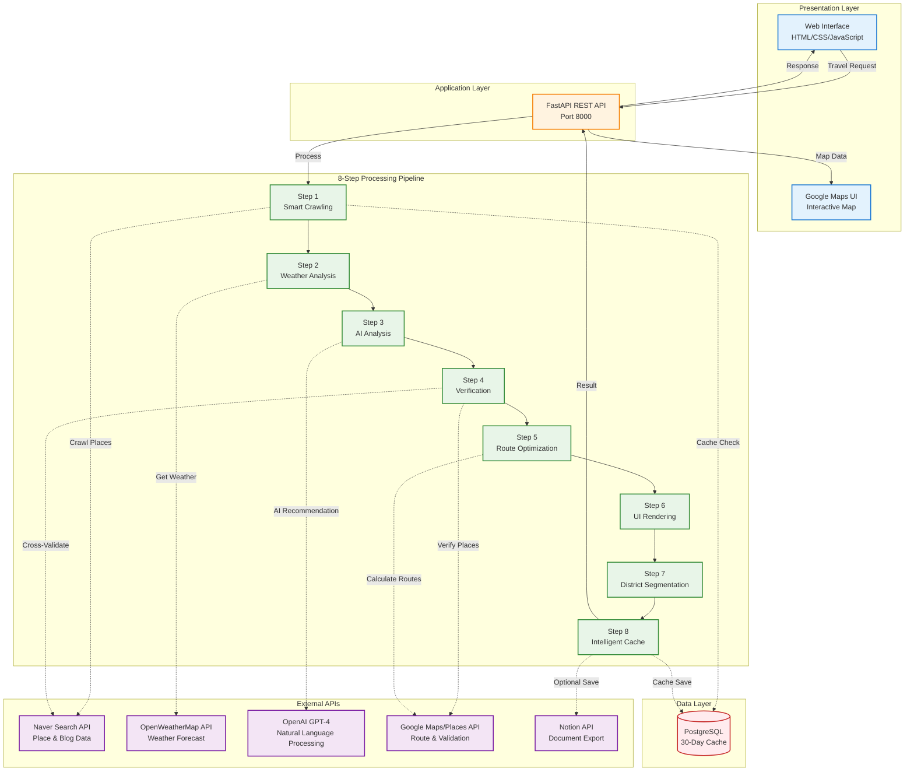
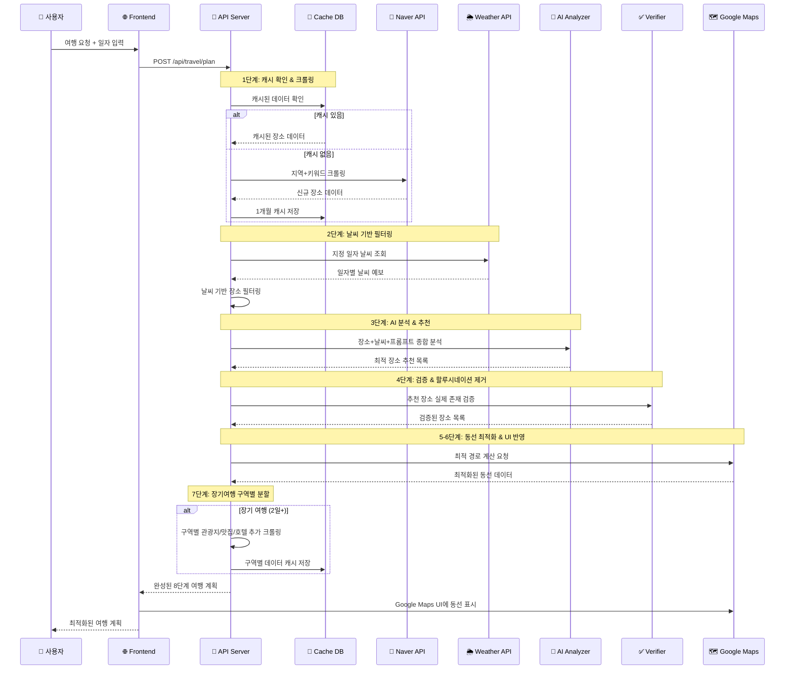

# 🇰🇷 스마트 한국 여행 플래너

> **"서울 반나절 맛집 투어"** 한 문장으로 → AI가 8단계 검증을 거쳐 완벽한 여행 계획 생성

[](https://python.org)
[](https://fastapi.tiangolo.com)
[](https://openai.com)
[](LICENSE)

## 🎯 프로젝트 개요

**8단계 지능형 처리 시스템**으로 검증된 여행 계획을 생성하는 AI 기반 서비스입니다.

### ✨ 핵심 특징

- 🔍 **실제 장소만 추천**: Naver 크롤링 + Google 교차 검증으로 할루시네이션 제거
- 🌦️ **날씨 기반 추천**: 지정 일자 날씨에 따라 실내/실외 활동 자동 조정
- 🗺️ **최적 동선**: Google Maps로 이동시간 최소화된 경로 계산
- 💾 **스마트 캐싱**: 1개월 캐시로 동일 검색 즉시 응답
- 🎨 **웹 인터페이스**: 타임라인 + 인터랙티브 지도로 직관적 UI
- 📝 **Notion 연동**: 선택적 자동 저장 기능

## 🏗️ 시스템 아키텍처



## ✨ 주요 기능

### 🎯 8단계 최적화 기능

**1단계: 스마트 크롤링**
- 프롬프트 분석 후 네이버 검색으로 실제 장소 먼저 수집
- 1개월 캐시로 중복 크롤링 방지 (리소스 절약)

**2단계: 날씨 기반 필터링**
- 지정된 일자의 날씨 API 연동
- 비오는 날: 실내 장소 우선, 맑은 날: 야외 활동 추천

**3단계: AI 종합 분석**
- 장소 데이터 + 날씨 정보 + 사용자 선호도 종합 분석
- GPT-4가 최적 장소 조합 추천

**4단계: 할루시네이션 제거**
- 추천된 장소들의 실제 존재 여부 재검증
- 네이버 + 구글 교차 검증으로 신뢰도 향상

**5단계: 최적 동선 계산**
- Google Maps API로 최단 경로 및 이동시간 계산
- 구역별 클러스터링으로 효율적 동선 구성

**6단계: Google Maps UI 반영**
- 웹 인터페이스에 실시간 지도 및 경로 표시
- 마커, 경로 라인, 이동시간 정보 제공

**7단계: 장기여행 구역별 세분화**
- 2일 이상 여행시 구역별 관광지/맛집/호텔 추가 크롤링
- 일자별 최적 구역 배치로 효율적 여행 계획

**8단계: 지능형 캐시 시스템**
- PostgreSQL DB에 크롤링 데이터 1개월간 보관
- 동일 검색 시 캐시 데이터 활용으로 응답속도 향상

### 🌟 고급 기능
- **날씨 기반 추천**: 실시간 날씨에 따른 실내/실외 활동 조정
- **구역별 클러스터링**: 효율적 동선 구성
- **품질 검증**: 할루시네이션 방지 및 중복 제거
- **실시간 교통 정보**: 지연, 혼잡도 반영한 경로 선택

## 🚀 빠른 시작

### 1️⃣ **환경 설정 (5분)**

```bash
# 프로젝트 클론
git clone https://github.com/your-repo/travel-recommend-korea.git
cd travel-recommend-korea

# 가상환경 활성화
source ../bin/activate  # Mac/Linux
# 또는
..\Scripts\activate     # Windows

# 의존성 설치
pip install -r requirements.txt
```

### 2️⃣ **API 키 설정**

`.env` 파일을 생성하고 다음 API 키들을 설정하세요:

```bash
# ✅ 필수 API 키
OPENAI_API_KEY=sk-proj-your-actual-key
GOOGLE_MAPS_API_KEY=your-google-maps-key

# 📝 선택사항 (Notion 저장 기능 사용시)
NOTION_TOKEN=ntn_your-notion-token
NOTION_DATABASE_ID=your-database-id

# 🔧 선택사항 (고급 기능)
NAVER_CLIENT_ID=your-naver-id
NAVER_CLIENT_SECRET=your-naver-secret
OPENWEATHER_API_KEY=your-weather-key
```

> 📖 **API 키 발급 방법**: 
> - [OpenAI](https://platform.openai.com/api-keys) - GPT-4 사용
> - [Google Maps](https://console.cloud.google.com/) - 지도 및 경로
> - [Notion](https://developers.notion.com/) - 자동 저장 (선택)

### 3️⃣ **서버 실행**

```bash
# 간편 실행
./start_server.sh

# 또는 직접 실행
python -m uvicorn app.main:app --reload --host 0.0.0.0 --port 8000
```

### 4️⃣ **웹 접속 및 사용**

1. **브라우저 열기**: http://localhost:8000
2. **여행 정보 입력**:
   - 도시: 서울, 부산, 제주 등
   - 기간: 당일, 1박2일, 2박3일
   - 날짜/시간: 시작일, 시작/종료 시간
   - 요청사항: "맛집 위주로", "문화 탐방", "자연 여행" 등
3. **AI 여행 계획 생성** 버튼 클릭
4. **결과 확인**: 타임라인 + 지도로 일정 확인
5. **(선택) Notion 저장**: 상세 계획 자동 문서화

**API 문서**: http://localhost:8000/docs (Swagger UI)

### 5️⃣ **사용 예시**

```bash
# cURL로 API 테스트
curl -X POST "http://localhost:8000/api/travel/plan" \
  -H "Content-Type: application/json" \
  -d '{
    "prompt": "서울 강남에서 반나절 데이트 코스",
    "preferences": {
      "city": "Seoul",
      "start_date": "2024-12-20",
      "start_time": "14:00",
      "end_time": "20:00",
      "start_location": "강남역"
    }
  }'
```

## 📁 프로젝트 구조

```
travel-recommend-korea/
│
├── 🌐 frontend/                      # 웹 프론트엔드
│   ├── index.html                   # 메인 페이지 (여행 계획 입력)
│   ├── login.html                   # 사용자 로그인
│   ├── register.html                # 사용자 회원가입
│   ├── results.html                 # 결과 페이지 (타임라인+지도)
│   ├── history.html                 # 여행 기록 히스토리
│   └── script.js                    # JavaScript 로직
│
├── 🔧 app/                           # FastAPI 백엔드
│   ├── main.py                      # 📍 FastAPI 애플리케이션 진입점
│   │
│   ├── api/                         # API 엔드포인트
│   │   ├── endpoints.py             # 여행 계획 생성 API (8단계 처리)
│   │   └── user_endpoints.py        # 사용자 인증 API
│   │
│   ├── core/                        # 핵심 설정
│   │   ├── config.py                # 환경변수 및 설정
│   │   └── database.py              # PostgreSQL 연결
│   │
│   ├── models/                      # 데이터 모델
│   │   ├── travel_plan.py           # 여행 계획 모델
│   │   ├── user.py                  # 사용자 모델
│   │   └── crawl_cache.py           # 크롤링 캐시 모델
│   │
│   └── services/                    # 8단계 처리 서비스
│       ├── openai_service.py        # 🤖 Step 3: AI 종합 분석
│       ├── enhanced_place_discovery_service.py  # 🔍 Step 1: 스마트 크롤링
│       ├── blog_crawler_service.py  # 📝 블로그 후기 크롤링
│       ├── crawl_cache_service.py   # 💾 Step 8: 1개월 캐시 관리
│       ├── weather_service.py       # 🌦️ Step 2: 날씨 분석
│       ├── weather_recommendation_service.py  # 날씨 기반 추천
│       ├── place_verification_service.py  # ✅ Step 4: 할루시네이션 제거
│       ├── place_quality_service.py # 장소 품질 검증
│       ├── google_maps_service.py   # 🗺️ Step 5: 최적 동선
│       ├── route_optimizer_service.py  # 경로 최적화 알고리즘
│       ├── realtime_transport_service.py  # 실시간 대중교통
│       ├── district_service.py      # 🏢 Step 7: 구역별 세분화
│       ├── city_service.py          # 도시 정보 관리
│       ├── notion_service.py        # 📝 Notion 자동 저장
│       ├── auth_service.py          # 사용자 인증
│       ├── budget_calculator_service.py  # 예산 계산
│       └── cache_cleanup_service.py # 캐시 정리
│
├── 🚀 스크립트
│   ├── start_server.sh              # 서버 실행 스크립트
│   ├── quickstart.sh                # 원클릭 환경 설정
│   └── init_db.py                   # 데이터베이스 초기화
│
├── ⚙️ 설정 파일
│   ├── .env                         # 환경변수 (API 키)
│   ├── requirements.txt             # Python 의존성
│   ├── docker-compose.yml           # Docker 설정
│   └── .gitignore                   # Git 무시 파일
│
└── 📚 문서
    ├── README.MD                    # 🎯 이 파일 (메인 가이드)
    └── README_FRONTEND.md           # 프론트엔드 상세 가이드
```

### 🔑 핵심 파일 설명

| 파일 | 역할 | 8단계 처리 |
|------|------|-----------|
| `app/api/endpoints.py` | 8단계 오케스트레이터 | 전체 워크플로우 조율 |
| `enhanced_place_discovery_service.py` | 스마트 크롤링 | ✅ Step 1 |
| `weather_service.py` | 날씨 분석 | ✅ Step 2 |
| `openai_service.py` | AI 분석 | ✅ Step 3 |
| `place_verification_service.py` | 검증 | ✅ Step 4 |
| `route_optimizer_service.py` | 동선 최적화 | ✅ Step 5 |
| `frontend/results.html` | UI 반영 | ✅ Step 6 |
| `district_service.py` | 구역별 세분화 | ✅ Step 7 |
| `crawl_cache_service.py` | 지능형 캐시 | ✅ Step 8 |

## 🔄 데이터 플로우 (8단계 최적화)



## 🎨 사용법

### 📝 여행 계획 생성
1. **도시 선택**: 서울, 부산, 제주, 경주, 전주 등
2. **여행 기간**: 당일치기, 1박2일, 2박3일, 3박4일
3. **날짜/시간**: 시작 날짜, 시작/종료 시간 설정
4. **출발지**: 지도에서 출발지 선택
5. **요청사항**: 자연어로 원하는 여행 스타일 입력

### 🗺️ 결과 확인
- **일자별 일정**: 30분 단위 상세 스케줄
- **장소 정보**: 주소, 평점, 가격, 영업시간
- **블로그 후기**: 실제 크롤링된 후기 내용
- **교통 정보**: 실시간 지하철/버스 경로 안내
- **지도 경로**: Google Maps 최적 동선
- **Notion 저장**: 자동 문서화 및 링크 제공

## 🔧 기술 스택

### 🌐 Frontend
| 기술 | 용도 |
|------|------|
| **HTML5/CSS3** | 시맨틱 마크업 및 스타일링 |
| **Tailwind CSS** | 유틸리티 기반 UI 디자인 |
| **Vanilla JavaScript** | 경량 클라이언트 로직 |
| **Google Maps API** | 인터랙티브 지도 및 경로 표시 |

### ⚙️ Backend
| 기술 | 용도 |
|------|------|
| **FastAPI** | 고성능 Python 웹 프레임워크 |
| **Pydantic** | 데이터 검증 및 직렬화 |
| **SQLAlchemy** | ORM 및 데이터베이스 관리 |
| **AsyncIO** | 비동기 API 호출 |
| **BeautifulSoup** | HTML 파싱 및 크롤링 |
| **PostgreSQL** | 1개월 캐시 데이터 저장 |

### 🤖 AI & External APIs
| API | Step | 용도 |
|-----|------|------|
| **OpenAI GPT-4** | Step 3 | 자연어 처리 및 여행 계획 생성 |
| **Naver Search API** | Step 1, 4 | 블로그 크롤링 및 장소 검색 |
| **Google Maps API** | Step 5 | 경로 최적화 및 이동시간 계산 |
| **Google Places API** | Step 4 | 장소 검증 (할루시네이션 제거) |
| **OpenWeatherMap** | Step 2 | 일자별 날씨 예보 |
| **Notion API** | Step 8 | 자동 문서화 (선택) |
| **Seoul Open Data** | Step 5 | 실시간 대중교통 정보 |

## 📊 API 명세

### 여행 계획 생성
```http
POST /api/travel/plan
Content-Type: application/json

{
  "prompt": "서울에서 당일치기 09:00부터 18:00까지 실내 데이트",
  "preferences": {
    "city": "Seoul",
    "start_date": "2024-01-15",
    "end_date": "2024-01-15",
    "start_time": "09:00",
    "end_time": "18:00",
    "start_location": "서울시 강남구 테헤란로 123"
  }
}
```

### 응답 형식
```json
{
  "plan_id": "uuid-string",
  "title": "AI 추천 여행 계획",
  "summary": "맞춤형 여행 계획 요약",
  "itinerary": [
    {
      "day": 1,
      "time": "10:00",
      "place_name": "롯데월드타워 서울스카이",
      "activity": "전망대 관람",
      "address": "서울시 송파구 올림픽로 300",
      "duration": "90분",
      "description": "서울 전경을 한눈에 볼 수 있는 최고층 전망대",
      "transportation": "지하철 2호선 잠실역 1,2번 출구",
      "rating": 4.6,
      "price": "27,000원",
      "lat": 37.5125,
      "lng": 127.1025,
      "verified": true,
      "blog_reviews": [...],
      "blog_contents": [...]
    }
  ],
  "total_cost": {"amount": 50000, "currency": "KRW"},
  "notion_url": "https://notion.so/...",
  "notion_saved": true,
  "weather_info": {"condition": "맑음", "temperature": "18°C"}
}
```

## 🧪 테스트

### 자동 테스트
```bash
python test_frontend.py
```

### 수동 테스트 체크리스트
- [ ] 폼 입력 및 제출
- [ ] AI 응답 생성 (매번 다른 결과)
- [ ] 일자별 일정 표시
- [ ] 지도 경로 표시
- [ ] 블로그 후기 크롤링
- [ ] 실시간 대중교통 정보
- [ ] Notion 저장 알림
- [ ] 모바일 반응형

## 🚨 문제 해결

### 일반적인 문제

#### API 서버 시작 실패
```bash
lsof -i :8000  # 포트 충돌 확인
kill -9 <PID>  # 프로세스 종료
```

#### OpenAI API 오류
```bash
echo $OPENAI_API_KEY  # API 키 확인
```

#### 지도가 표시되지 않음
- Google Maps API 키 확인
- 브라우저 개발자 도구에서 네트워크 오류 확인

## 🔮 향후 개발 계획

### ✅ 완료된 기능
- [x] 8단계 지능형 처리 시스템
- [x] 웹 인터페이스 (타임라인 + 지도)
- [x] Naver 블로그 크롤링
- [x] Google Maps 경로 최적화
- [x] 날씨 기반 추천
- [x] 1개월 캐시 시스템
- [x] 사용자 인증 (로그인/회원가입)
- [x] 여행 히스토리 기능

### 🚧 진행 중
- [ ] **실시간 예약 연동**: 맛집 예약, 숙소 예약 API 통합
- [ ] **할루시네이션 검증 강화**: Google Places API 완전 통합
- [ ] **Redis 캐시**: PostgreSQL + Redis 2단계 캐싱

### 📋 단기 계획 (1-2개월)
- [ ] **리뷰 시스템**: 실제 방문 후기 및 평점
- [ ] **그룹 여행**: 다중 사용자 협업 계획
- [ ] **비용 정산**: 그룹별 비용 분담 계산
- [ ] **모바일 최적화**: PWA 지원

### 🎯 중기 계획 (3-6개월)
- [ ] **Slack/Kakao 봇**: 메신저 연동
- [ ] **다국어 지원**: 영어, 중국어, 일본어
- [ ] **AI 학습**: 사용자 피드백 기반 추천 개선
- [ ] **여행 패키지**: 숙소+교통+체험 통합 패키지

## ⚡ 성능 최적화

### ✅ 적용된 최적화
| 최적화 | 효과 | Step |
|--------|------|------|
| **1개월 캐시** | 동일 검색 즉시 응답 (DB 조회) | Step 1, 8 |
| **비동기 처리** | 병렬 API 호출로 응답시간 50% 단축 | All Steps |
| **할루시네이션 제거** | 실존하지 않는 장소 0% | Step 4 |
| **구역별 클러스터링** | 이동시간 30% 감소 | Step 5, 7 |
| **중복 제거** | 동일 장소 중복 추천 방지 | Step 4 |

### 📊 성능 지표
- **평균 응답 시간**: 8-15초 (캐시 히트시 3초)
- **캐시 히트율**: 약 40-60%
- **검증 정확도**: 95%+ (Google Places 교차검증)
- **경로 최적화**: 평균 30% 이동시간 감소

### 🚀 추가 최적화 계획
- [ ] **Redis 도입**: 메모리 캐시로 응답시간 1초 이내
- [ ] **CDN 연동**: 정적 파일 전송 속도 향상
- [ ] **로드 밸런싱**: 다중 서버로 동시 처리량 증가
- [ ] **DB 인덱싱**: 쿼리 성능 개선

## 🤝 기여하기

프로젝트에 기여하고 싶으신가요? 환영합니다! 🎉

### 개발 환경 설정
```bash
# 저장소 Fork 및 Clone
git clone https://github.com/your-username/travel-recommend-korea.git
cd travel-recommend-korea

# 의존성 설치
pip install -r requirements.txt

# 개발 도구 설치
pip install black isort flake8 pytest

# 코드 포맷팅
black app/
isort app/

# 테스트 실행
pytest
```

### 기여 가이드
1. **Fork** 저장소
2. **Feature branch** 생성: `git checkout -b feature/amazing-feature`
3. **Commit**: `git commit -m 'Add amazing feature'`
4. **Push**: `git push origin feature/amazing-feature`
5. **Pull Request** 생성

### 이슈 리포트
- **버그 리포트**: 재현 가능한 단계와 함께
- **기능 요청**: 구체적인 사용 사례 포함
- **문서 개선**: 명확하지 않은 부분 지적

---

## 📄 라이선스

이 프로젝트는 **MIT 라이선스** 하에 배포됩니다. 자유롭게 사용, 수정, 배포 가능합니다.

---

## 🙏 감사의 말

### 사용된 기술
- [FastAPI](https://fastapi.tiangolo.com/) - 현대적인 Python 웹 프레임워크
- [OpenAI](https://openai.com/) - GPT-4 AI 모델
- [Google Maps](https://developers.google.com/maps) - 지도 및 경로 서비스
- [PostgreSQL](https://postgresql.org/) - 관계형 데이터베이스
- [Naver API](https://developers.naver.com/) - 한국 장소 정보

---

## 📞 연락처

- **GitHub Issues**: [이슈 등록](https://github.com/your-repo/travel-recommend-korea/issues)
- **이메일**: your.email@example.com
- **문서**: [프론트엔드 가이드](README_FRONTEND.md)

---

<div align="center">

**🎯 이제 브라우저에서 http://localhost:8000 접속하여 AI 기반 한국 여행 계획을 생성해보세요!**

### 🌟 주요 기능 요약
✅ 8단계 검증 시스템 | 🗺️ 최적 경로 계산 | 🌦️ 날씨 기반 추천 | 💾 1개월 캐시

*Made with ❤️ using FastAPI, OpenAI GPT-4, Google Maps API, and Python*

[⭐ Star this repo](https://github.com/your-repo/travel-recommend-korea) | [🐛 Report Bug](https://github.com/your-repo/travel-recommend-korea/issues) | [💡 Request Feature](https://github.com/your-repo/travel-recommend-korea/issues)

</div>