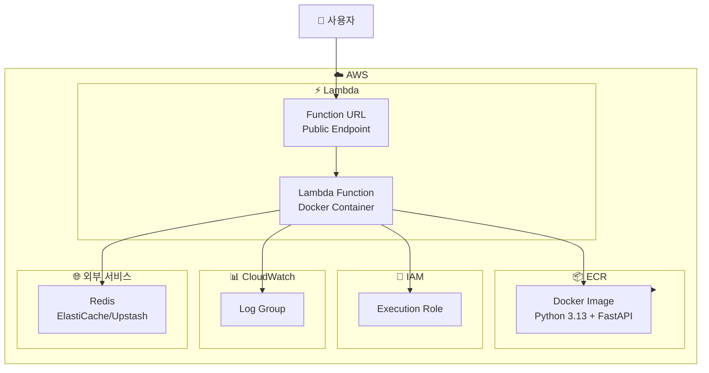

# 🚀 Travel Recommend Korea - AWS Lambda 배포

이 디렉토리는 Travel Recommend Korea 애플리케이션을 AWS Lambda에 Docker 이미지로 배포하기 위한 Terraform 코드를 포함합니다.

## 📋 사전 요구사항

1. **AWS CLI 설치 및 구성**
   ```bash
   aws configure
   ```

2. **Terraform 설치** (버전 >= 1.0)
   ```bash
   terraform version
   ```

3. **Docker 설치**
   ```bash
   docker --version
   ```

4. **필수 AWS 권한**
   - ECR 리포지토리 생성/관리
   - Lambda 함수 생성/관리
   - IAM 역할 생성/관리
   - CloudWatch Logs 생성/관리
   - Function URL 생성/관리

## 🏗️ 아키텍처



## 🚀 배포 방법

### 1단계: Terraform 변수 설정

```bash
cd terraform
cp terraform.tfvars.example terraform.tfvars
```

`terraform.tfvars` 파일을 편집하여 환경 변수를 설정하세요:

```hcl
aws_region  = "ap-northeast-2"
environment = "dev"

environment_variables = {
  OPENAI_API_KEY      = "sk-proj-your-key"
  GOOGLE_MAPS_API_KEY = "your-google-key"
  NAVER_CLIENT_ID     = "your-naver-id"
  NAVER_CLIENT_SECRET = "your-naver-secret"
  OPENWEATHER_API_KEY = "your-weather-key"
  NOTION_TOKEN        = "your-notion-token"
  REDIS_URL           = "redis://your-redis-host:6379/0"
  # ... 기타 환경 변수
}
```

### 2단계: Terraform 초기화 및 적용

```bash
# Terraform 초기화
terraform init

# 실행 계획 확인
terraform plan

# 인프라 생성
terraform apply
```

### 3단계: Docker 이미지 빌드 및 푸시

배포 스크립트를 사용하거나 수동으로 실행:

```bash
# 자동 배포 스크립트 사용 (권장)
./terraform/deploy.sh

# 또는 수동 배포
# ECR 로그인
aws ecr get-login-password --region ap-northeast-2 | \
  docker login --username AWS --password-stdin \
  $(terraform output -raw ecr_repository_url | cut -d'/' -f1)

# 이미지 빌드 (프로젝트 루트에서)
cd ..
docker build -f Dockerfile.lambda -t travel-recommend-korea:latest .

# 이미지 태그 지정
docker tag travel-recommend-korea:latest \
  $(cd terraform && terraform output -raw ecr_repository_url):latest

# ECR에 푸시
docker push $(cd terraform && terraform output -raw ecr_repository_url):latest
```

### 4단계: Lambda 함수 업데이트

이미지를 푸시한 후 Lambda 함수를 업데이트합니다:

```bash
# 자동 업데이트 (새 이미지 감지)
aws lambda update-function-code \
  --function-name $(terraform output -raw lambda_function_name) \
  --image-uri $(terraform output -raw ecr_repository_url):latest \
  --region ap-northeast-2
```

또는 AWS 콘솔에서 Lambda 함수의 "Deploy new image" 버튼을 클릭하세요.

### 5단계: Function URL 확인

```bash
terraform output lambda_function_url
```

브라우저에서 해당 URL로 접속하여 애플리케이션이 정상 작동하는지 확인하세요.

## 📝 주요 리소스

### ECR 리포지토리
- Docker 이미지 저장소
- 이미지 스캔 및 생명주기 정책 자동 적용
- 최근 10개 이미지만 유지 (자동 삭제)

### Lambda 함수
- Docker 컨테이너 기반 실행
- Mangum을 사용하여 FastAPI 앱을 Lambda 핸들러로 변환
- 설정 가능한 메모리 및 타임아웃
- 환경 변수 지원

### Function URL
- 공개 엔드포인트 제공
- CORS 설정 지원
- 인증 타입 선택 가능 (AWS_IAM 또는 NONE)

### IAM 역할
- Lambda 실행 권한
- CloudWatch Logs 쓰기 권한
- 필요 시 추가 권한 확장 가능 (Secrets Manager, VPC 등)

## 🔧 설정 옵션

### Lambda 메모리 및 타임아웃

`terraform.tfvars`에서 조정:

```hcl
lambda_memory_size = 2048  # MB (최소 128, 최대 10240)
lambda_timeout     = 600   # 초 (최대 900초)
```

### Function URL CORS 설정

```hcl
function_url_cors_origins = ["https://example.com"]
function_url_cors_methods = ["GET", "POST", "OPTIONS"]
function_url_cors_headers = ["Content-Type", "Authorization"]
```

### 환경 변수 관리

#### 방법 1: terraform.tfvars에 직접 설정 (간단)
```hcl
environment_variables = {
  OPENAI_API_KEY = "sk-proj-xxx"
}
```

#### 방법 2: AWS Secrets Manager 사용 (권장 - 프로덕션)
1. Secrets Manager에 시크릿 생성:
   ```bash
   aws secretsmanager create-secret \
     --name travel-recommend-korea/api-keys \
     --secret-string '{"OPENAI_API_KEY":"sk-proj-xxx","GOOGLE_MAPS_API_KEY":"xxx"}'
   ```

2. `iam.tf`의 `lambda_additional` 정책에서 Secrets Manager 접근 권한 활성화:
   ```hcl
   {
     Effect = "Allow"
     Action = [
       "secretsmanager:GetSecretValue",
       "secretsmanager:DescribeSecret"
     ]
     Resource = "arn:aws:secretsmanager:${var.aws_region}:*:secret:travel-recommend-korea/*"
   }
   ```

3. Lambda 함수에서 시크릿 읽기 (런타임에)

#### 방법 3: 환경 변수로 전달
```bash
export TF_VAR_environment_variables='{"OPENAI_API_KEY":"sk-proj-xxx"}'
terraform apply
```

### Redis 설정

Lambda에서는 외부 Redis 서버가 필요합니다:

#### 옵션 1: AWS ElastiCache (VPC 내부)
- VPC 설정 필요
- Lambda 함수를 VPC에 배치
- `REDIS_URL = "redis://your-elasticache-endpoint:6379/0"`

#### 옵션 2: 외부 Redis 서버 (Upstash, Redis Cloud 등)
- VPC 설정 불필요
- `REDIS_URL = "redis://your-redis-host:6379/0"`

#### 옵션 3: Redis 없이 사용
- 캐싱 비활성화
- 성능 저하 가능
- `REDIS_URL = ""` 또는 변수 제거

## 🔍 모니터링

### CloudWatch Logs 확인

```bash
aws logs tail /aws/lambda/travel-recommend-korea-dev --follow --region ap-northeast-2
```

### Lambda 메트릭 확인

AWS 콘솔의 Lambda > Monitoring 탭에서 확인:
- 호출 횟수
- 에러율
- 지속 시간
- 동시 실행 수
- 메모리 사용량

### X-Ray 추적 (선택사항)

`terraform.tfvars`에서 활성화:

```hcl
enable_xray_tracing = true
```

## 🗑️ 리소스 삭제

```bash
terraform destroy
```

⚠️ **주의**: 이 명령은 모든 리소스를 삭제합니다. ECR 리포지토리의 이미지도 삭제됩니다.

## 🔄 업데이트 프로세스

코드 변경 후 재배포:

```bash
# 1. 코드 변경
# 2. Docker 이미지 재빌드 및 푸시
cd terraform
./deploy.sh

# 또는 수동으로:
cd ..
docker build -f Dockerfile.lambda -t travel-recommend-korea:latest .
docker tag travel-recommend-korea:latest $(cd terraform && terraform output -raw ecr_repository_url):latest
docker push $(cd terraform && terraform output -raw ecr_repository_url):latest

# 3. Lambda 함수 업데이트
aws lambda update-function-code \
  --function-name $(cd terraform && terraform output -raw lambda_function_name) \
  --image-uri $(cd terraform && terraform output -raw ecr_repository_url):latest \
  --region ap-northeast-2
```

## 🐛 문제 해결

### Lambda 함수가 시작되지 않음
- CloudWatch Logs 확인: `/aws/lambda/travel-recommend-korea-dev`
- 환경 변수 확인 (특히 API 키)
- Docker 이미지가 올바르게 빌드되었는지 확인
- Lambda 핸들러 경로 확인: `app.lambda_handler.handler`

### Function URL 접속 불가
- Function URL이 활성화되어 있는지 확인: `terraform output lambda_function_url`
- CORS 설정 확인
- Lambda 함수의 권한 확인
- CloudWatch Logs에서 에러 확인

### 이미지 크기 제한
- Lambda Docker 이미지는 10GB 제한
- 불필요한 파일 제거 (`.dockerignore` 확인)
- 멀티 스테이지 빌드 사용 고려

### Redis 연결 실패
- `REDIS_URL` 환경 변수 확인
- Redis 서버가 접근 가능한지 확인
- VPC 설정 확인 (ElastiCache 사용 시)
- 보안 그룹 설정 확인

### API 키 관련 에러
- 환경 변수가 올바르게 설정되었는지 확인
- Secrets Manager 사용 시 IAM 권한 확인
- API 키가 유효한지 확인

## 📚 참고 자료

- [AWS Lambda Container Images](https://docs.aws.amazon.com/lambda/latest/dg/images-create.html)
- [Lambda Function URLs](https://docs.aws.amazon.com/lambda/latest/dg/lambda-urls.html)
- [Mangum - ASGI to Lambda](https://mangum.io/)
- [Terraform AWS Provider](https://registry.terraform.io/providers/hashicorp/aws/latest/docs)
- [AWS Secrets Manager](https://docs.aws.amazon.com/secretsmanager/)
- [AWS ElastiCache](https://docs.aws.amazon.com/elasticache/)

## 🔐 보안 권장사항

1. **API 키 관리**
   - 프로덕션에서는 AWS Secrets Manager 사용
   - 환경 변수에 직접 저장하지 않기
   - 정기적으로 키 로테이션

2. **Function URL 보안**
   - 프로덕션에서는 `function_url_auth_type = "AWS_IAM"` 사용
   - CORS 설정을 특정 도메인으로 제한
   - Rate Limiting 고려 (API Gateway 사용)

3. **네트워크 보안**
   - VPC 사용 시 보안 그룹 설정
   - Redis 접근 제한
   - 최소 권한 원칙 적용

4. **모니터링 및 알림**
   - CloudWatch 알람 설정
   - 비정상적인 트래픽 감지
   - 에러율 모니터링
